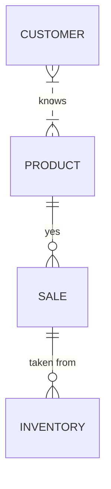

# NikeStore_ERD.md.

---
title: Nike Store ERD
---

# Explanation 
  - This is my attempt to understand and produce a very rudimentary erDiagram in Mermaid. I will continue to modify and add features, but this is my initial submission. It took me all day to get to this point! 
